> [!NOTE]
> This repo is an extension mod for [Town of Us: Mira](https://github.com/AU-Avengers/TOU-Mira) that adds new roles and modifiers.
> This mod requires Town of Us: Mira to be installed and is NOT for console versions of Among Us.

-----------------------

<div align="center">
  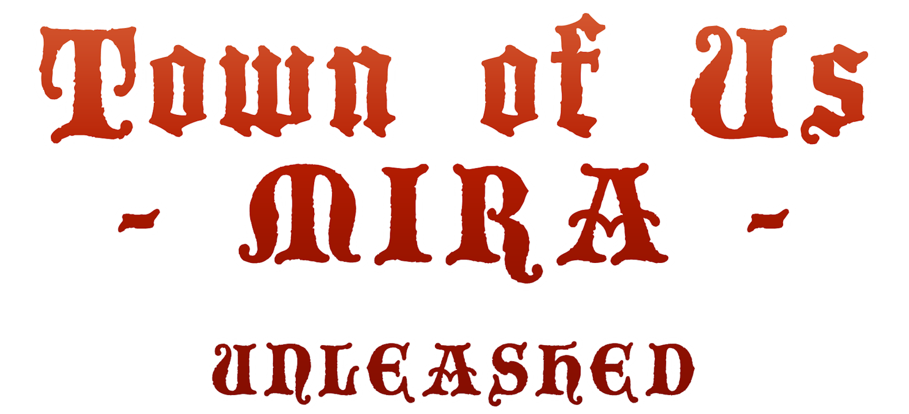
  <p><b>Mira Unleashed</b></p>
  <p>formerly Town of Us Mira Roles Extension</p>
</div>
<br/>

An extension mod for [Town of Us: Mira](https://github.com/AU-Avengers/TOU-Mira) that adds new roles and modifiers to enhance your gameplay experience!

[](https://github.com/rewalo/TownOfUsMiraUnleashed/actions/workflows/build.yml)
[](https://github.com/rewalo/TownOfUsMiraUnleashed/releases/latest)
[](./LICENSE)
[](#compatibility)

-----------------------

# Contents

- [**Contents**](#contents)
- [**Roles & Modifiers**](#roles--modifiers)
- [**Installation**](#installation)
- [**Compatibility**](#compatibility)
- [**Building**](#building)
- [**Branches**](#branches)
- [**Documentation**](#documentation)
- [**Contributing**](#contributing)
- [**Credits**](#credits)
- [**License**](#license)
- [**Copyright**](#copyright)

-----------------------

# Roles & Modifiers

<p align="center">
  
  <a href="./docs/Forestaller.md">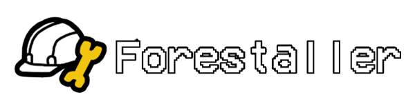</a>
  <a href="./docs/Mirage.md">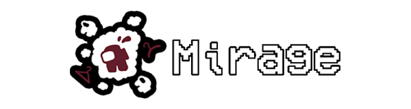</a>
  <a href="./docs/Trapper.md">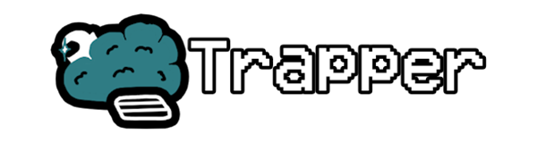</a>
  
  <a href="./docs/Charlatan.md">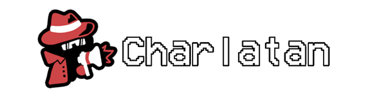</a>
  <a href="./docs/Hacker.md">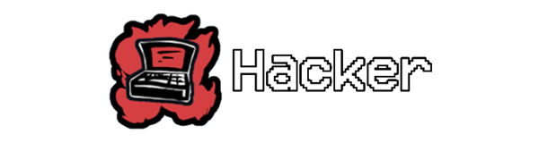</a>
  <a href="./docs/Injector.md">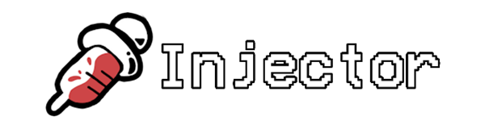</a>
  
  <a href="./docs/Witch.md">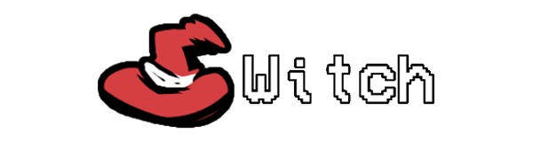</a>
  
  <a href="./docs/Wraith.md">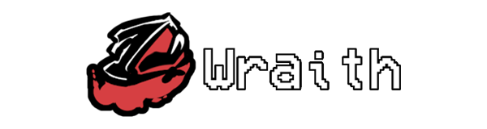</a>
  
  <a href="./docs/Lawyer.md">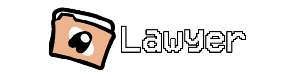</a>
  
  <a href="./docs/Serial-Killer.md"></a>
  
  <a href="./docs/Scavenger.md">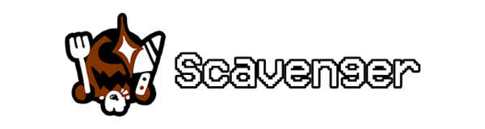</a>
  
  <a href="./docs/Clueless.md">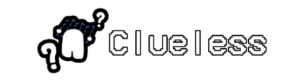</a>
  <a href="./docs/Spiteful.md">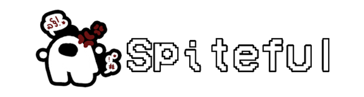</a>
</p>

Click a role for its abilities, options and interactions, or browse the [wiki](https://github.com/rewalo/TownOfUsMiraUnleashed/wiki).

-----------------------

# Installation

1. Install [Town of Us: Mira](https://github.com/AU-Avengers/TOU-Mira) (it bundles MiraAPI, Reactor and BepInEx). Check the [Compatibility](#compatibility) table for the TOU-Mira version that matches the Mira Unleashed release you are installing.
2. Download the latest `MiraUnleashed.dll` from [Releases](https://github.com/rewalo/TownOfUsMiraUnleashed/releases), or build it yourself.
3. Place `MiraUnleashed.dll` in your `Among Us/BepInEx/plugins/` folder.
4. Launch the game. The mod's config file is `BepInEx/config/rewalo.mira.unleashed.cfg`.

-----------------------

# Compatibility

| Mira Unleashed | Town of Us: Mira | MiraAPI | Reactor |
| --- | --- | --- | --- |
| 2.1.0 | 1.7.3 | 0.5.0 | 2.5.0 |
| 2.0.0 | 1.7.3 | 0.5.0 | 2.5.0 |

The table is updated with every release; the latest row applies to the newest release.

The `experimental` branch of this repo tracks TOU-Mira's experimental branch and may target unreleased TOU-Mira builds.

Mira Unleashed also integrates with [Perfect Comms](https://github.com/artriy/Perfect-Comms) for optional proximity voice chat features — see the [Voice Chat](https://github.com/rewalo/TownOfUsMiraUnleashed/wiki/Voice-Chat) wiki page.

-----------------------

# Building

Requires the .NET 10 SDK (see `global.json`).

1. Clone this repository.
2. `dotnet restore`
3. `dotnet build -c Release`

Optionally create `Directory.Build.local.props` (git-ignored) with an `<AmongUs>` property pointing at your Among Us install to auto-copy the built DLL to `BepInEx/plugins` after each build:

```xml
<Project>
  <PropertyGroup>
    <AmongUs>C:\Program Files (x86)\Steam\steamapps\common\Among Us</AmongUs>
  </PropertyGroup>
</Project>
```

-----------------------

# Branches

- `main` – releases only.
- `dev` – active development; the next version is built here.
- `experimental` – tracks TOU-Mira's experimental branch; rebased on `dev`.

-----------------------

# Documentation

Role and modifier details, options, and testing checklists live in [docs/](./docs) and are mirrored to the [GitHub Wiki](https://github.com/rewalo/TownOfUsMiraUnleashed/wiki).

-----------------------

# Contributing

See [CONTRIBUTING.md](./CONTRIBUTING.md). Pull requests target `dev`. Please read the [AI usage policy](./CONTRIBUTING.md#ai-usage-policy) before contributing.

-----------------------

# Credits

## Art Credits

- **Asterisken** - Art for Injector, Trapper, Clueless, Mirage, Charlatan, Scavenger, Forestaller, and Spiteful
- **Atony** - Art for Serial Killer, Lawyer, Witch, and Wraith
- **Stellar Roles** - Role Ideas, some art (buttons)

-----------------------

# License
This software is distributed under the GNU GPLv3 License. See [LICENSE](./LICENSE).

# Copyright
<p align="center">This mod is not affiliated with Among Us or Innersloth LLC, and the content contained therein is not endorsed or otherwise sponsored by Innersloth LLC. Portions of the materials contained herein are property of Innersloth LLC.</p>
<p align="center">© Innersloth LLC.</p>
