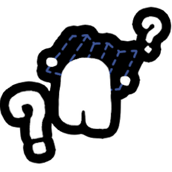
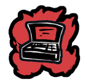
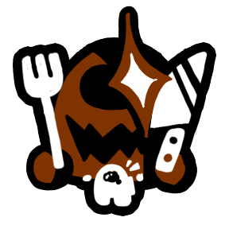
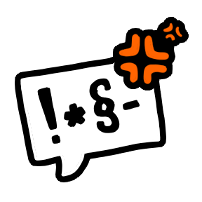
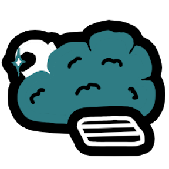
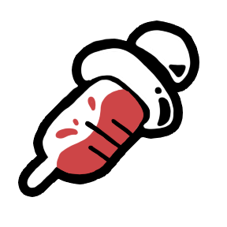
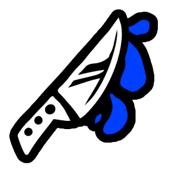
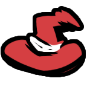
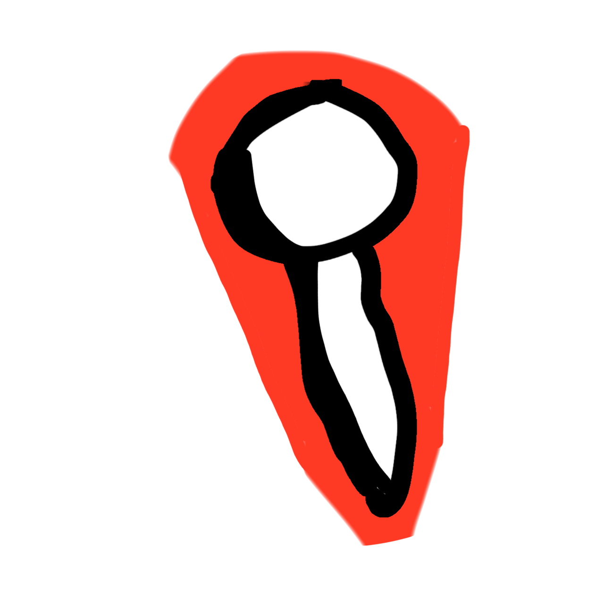

# Mira Unleashed

An extension mod for [Town of Us: Mira](https://github.com/AU-Avengers/TOU-Mira) that adds new roles and modifiers. Formerly known as Town of Us Mira Roles Extension.

## Getting started

- [Installation](Installation)
- [Configuration](Configuration)
- [Voice Chat](Voice-Chat)
- [Building from source](Building)
- [Testing checklist](Testing)

## Contents

<table>
  <tr>
    <th align="center">Crewmate Roles</th>
    <th align="center">Impostor Roles</th>
    <th align="center">Neutral Roles</th>
    <th align="center">Modifiers</th>
  </tr>
  <tr>
    <td align="center"> <a href="Forestaller">Forestaller</a> <i>Crewmate Support</i></td>
    <td align="center"> <a href="Charlatan">Charlatan</a> <i>Impostor Support</i></td>
    <td align="center"> <a href="Lawyer">Lawyer</a> <i>Neutral Benign</i></td>
    <td align="center"> <a href="Clueless">Clueless</a> <i>Universal</i></td>
  </tr>
  <tr>
    <td align="center"> <a href="Mirage">Mirage</a> <i>Crewmate Support</i></td>
    <td align="center"> <a href="Hacker">Hacker</a> <i>Impostor Support</i></td>
    <td align="center"> <a href="Scavenger">Scavenger</a> <i>Neutral Evil</i></td>
    <td align="center"> <a href="Spiteful">Spiteful</a> <i>Universal</i></td>
  </tr>
  <tr>
    <td align="center"> <a href="Trapper">Trapper</a> <i>Crewmate Support</i></td>
    <td align="center"> <a href="Injector">Injector</a> <i>Impostor Support</i></td>
    <td align="center"> <a href="Serial-Killer">Serial Killer</a> <i>Neutral Killing</i></td>
    <td align="center"></td>
  </tr>
  <tr>
    <td align="center"></td>
    <td align="center"> <a href="Witch">Witch</a> <i>Impostor Killing</i></td>
    <td align="center"></td>
    <td align="center"></td>
  </tr>
  <tr>
    <td align="center"></td>
    <td align="center"> <a href="Wraith">Wraith</a> <i>Impostor Power</i></td>
    <td align="center"></td>
    <td align="center"></td>
  </tr>
</table>
